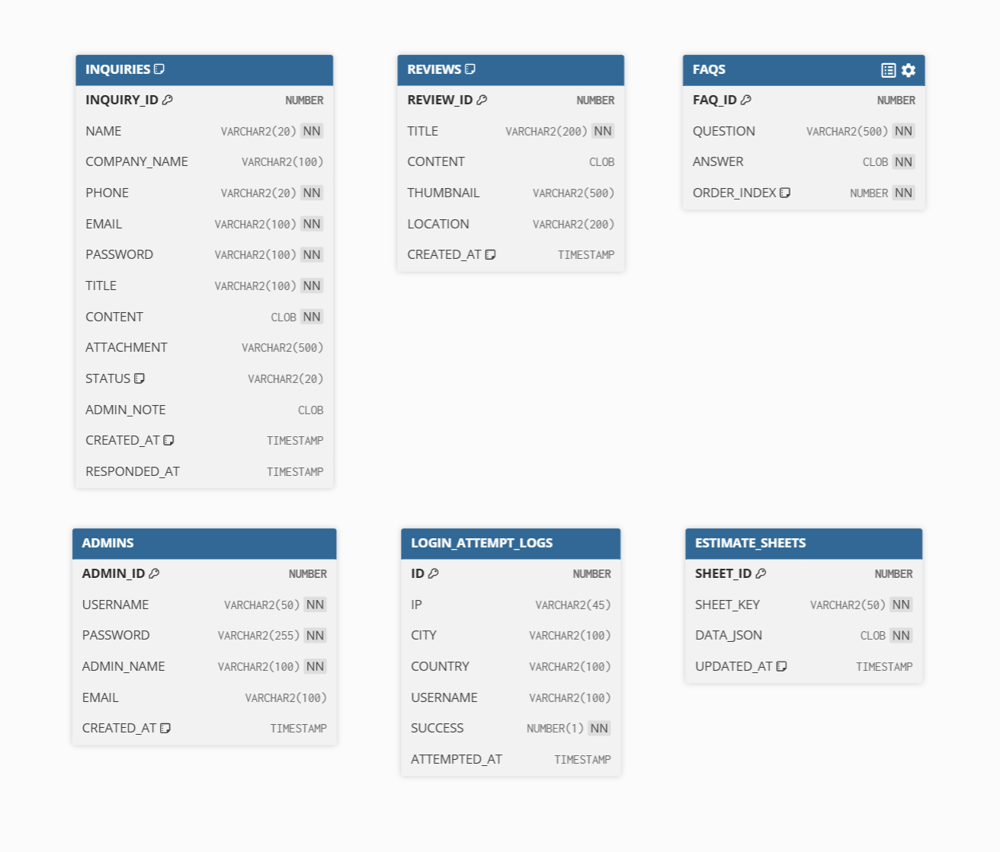

# 프르조 (PRZO) — 해충방제 전문 기업 웹사이트

> 실제 클라이언트 수주 프로젝트입니다. 요구사항 수집부터 설계, 개발, 배포까지 1인 풀스택으로 진행했습니다.

**🔗 배포 주소:** https://przo.kr

---

## 프로젝트 개요

해충방제 전문 기업 프르조의 기업 소개 및 상담 문의 웹사이트입니다.
Figma 디자인 시안을 기반으로 프론트엔드를 구현하고, 백엔드 및 서버 인프라를 직접 설계·구축했습니다.

| 항목 | 내용 |
|---|---|
| 개발 기간 | 2026.02 ~ 2026.03 |
| 개발 인원 | 1인 (풀스택) |
| 역할 | 백엔드 개발, 프론트엔드 개발, 서버 인프라 구축, 배포 |

---

## 기술 스택

### Backend
- **Java 17** / **Spring Boot 3.5**
- Spring Security, Spring Data JPA, Spring Mail
- **Oracle Autonomous Database** (Oracle Cloud Always Free)
- Gradle

### Frontend
- **React 18** / **Vite**
- React Router DOM v7
- CSS Modules

### Infrastructure
- **Oracle Cloud** — VM.Standard.E2.1.Micro (Ubuntu 22.04)
- **Nginx** — 리버스 프록시, HTTP → HTTPS 리다이렉트
- **Let's Encrypt** — SSL 인증서 자동 갱신
- **Cloudflare Turnstile** — CAPTCHA

---

## 주요 기능

### 사용자
- 회사 소개 / 서비스 소개 / 시공 사진 / FAQ 페이지
- 상담 문의 등록 · 조회 · 수정 · 삭제
- 문의 비밀번호 기반 본인 확인 (BCrypt 해싱)
- 파일 첨부 (이미지, PDF / 최대 10MB)
- 이메일 답변 알림

### 관리자
- HttpOnly 쿠키 기반 토큰 인증 (XSS 방어)
- 문의 답변 등록 / 상태 관리
- FAQ 등록 · 수정 · 삭제 · 순서 변경
- 시공 사진 등록 · 삭제
- 견적서 작성 (공유 링크 발급)
- 로그인 시도 기록 조회 (IP, 위치, 성공 여부)

### 보안
- IP 기반 Rate Limiting (로그인 5회 실패 시 30분 차단)
- 단계별 CAPTCHA (Cloudflare Turnstile)
- 서버사이드 입력 검증
- 파일 확장자 + MIME 타입 이중 검증
- CORS 허용 출처 명시
- 개인정보 자동 삭제 스케줄러 (문의 3년, 로그인 기록 180일)

---

## 디자인 & 화면

<details>
<summary>🎨 UI 디자인 (Figma)</summary>

<br>

> GitHub은 Figma 임베드를 지원하지 않아, 아래 버튼으로 직접 열어볼 수 있습니다.

[](https://www.figma.com/design/S38zCYEqy6md5Z1mtS5Em2/PRZO-%EA%B3%B5%EC%9C%A0%EC%9A%A9?node-id=0-1&t=MipnivytSBZbvwZy-1)

</details>

<details>
<summary>🖥️ 화면 캡처</summary>

<br>

| 메인 페이지 | 서비스 소개 |
|---|---|
|  |  |

| 상담 문의 | 관리자 대시보드 |
|---|---|
|  |  |

</details>

---

## 데이터베이스 구조 (ERD)



총 6개의 독립 테이블로 구성되며, 서비스 도메인별로 명확히 분리되어 있습니다.

| 테이블 | 설명 |
|---|---|
| `INQUIRIES` | 상담 문의 — 고객 연락처, 제목·내용, 첨부파일, 처리 상태, 관리자 메모 |
| `REVIEWS` | 시공 후기 — 업체명, 별점, 썸네일, 지역 |
| `FAQS` | FAQ — 질문·답변, 노출 순서 관리 |
| `ADMINS` | 관리자 계정 — 로그인 자격증명 |
| `LOGIN_ATTEMPT_LOG` | 로그인 시도 기록 — IP, 지역, 성공 여부 (보안 모니터링용) |
| `ESTIMATE_SHEETS` | 견적서 — JSON 형태로 견적 데이터 저장, 공유 링크 키 기반 조회 |

---

## 아키텍처

```
[Client]
    │
    ▼
[Nginx]  ── HTTPS (Let's Encrypt)
    │
    ├── / ──────────────── React SPA (정적 파일 서빙)
    └── /api ────────────→ Spring Boot (8080)
                                │
                                ├── Oracle Autonomous DB
                                └── /uploads (파일 저장)
```

---

## 로컬 실행 방법

### 사전 요구사항
- Java 17+
- Node.js 18+
- Oracle Database XE (로컬 DB)

### Backend
```bash
cd back-end
./gradlew bootRun
```
> `src/main/resources/application-local.properties` 파일에 로컬 DB 정보 설정 필요

### Frontend
```bash
cd front-end
npm install
npm run dev
```

---

## 디렉토리 구조

```
przo/
├── back-end/                      # Spring Boot 백엔드
│   ├── gradle/wrapper/
│   ├── src/
│   │   ├── main/java/.../company_web/
│   │   │   ├── config/                   # Security, CORS, RateLimit 설정
│   │   │   ├── controller/               # REST API 엔드포인트
│   │   │   ├── dto/                      # 요청/응답 DTO
│   │   │   ├── entity/                   # JPA 엔티티
│   │   │   ├── repository/               # Spring Data JPA
│   │   │   ├── scheduler/                # 오래된 문의 자동 삭제
│   │   │   ├── service/                  # 비즈니스 로직
│   │   │   ├── util/                     # 유틸리티 (비밀번호 생성 등)
│   │   │   └── CompanyWebApplication.java
│   │   ├── resources/META-INF/
│   │   │   └── additional-spring-configuration-metadata.json
│   │   └── test/                         # 단위/통합 테스트
│   ├── uploads/                          # 업로드 파일 저장소 (내용은 gitignore)
│   │   ├── inquiries/
│   │   └── reviews/
│   ├── build.gradle
│   └── settings.gradle
│
├── database/                     # Oracle 데이터베이스
│   ├── PRZO_ERD.png                      # ERD 다이어그램
│   └── przo.sql                          # DB 스키마 및 초기 데이터
│
├── front-end/                    # React + Vite 프론트엔드
│   ├── patches/                          # 라이브러리 패치 (fortune-sheet)
│   ├── public/                           # 정적 파일 (폰트, 파비콘, sitemap 등)
│   ├── scripts/
│   │   └── convert-to-webp.mjs           # 이미지 → WebP 변환 스크립트
│   ├── src/
│   │   ├── assets/                       # 이미지, 아이콘 등 정적 자산
│   │   ├── components/                   # 공통 컴포넌트 (Header, Footer, Modal 등)
│   │   ├── context/
│   │   │   └── AuthContext.jsx           # 관리자 인증 상태 관리
│   │   ├── layouts/                      # AdminLayout / MainLayout
│   │   ├── pages/                        # 페이지 컴포넌트
│   │   │   ├── Home / About / Service / Faq       # 일반 페이지
│   │   │   ├── Qna / QnaDetail / QnaWrite         # 문의 게시판
│   │   │   ├── Reviews / ReviewWrite              # 후기 게시판
│   │   │   ├── EstimateSheet / PriceTable         # 가격 견적/관리 (관리자)
│   │   │   ├── AdminLogin / AdminLogs             # 관리자 인증/로그
│   │   │   └── PrivacyPolicy / Terms / CookiePolicy / NotFound
│   │   ├── utils/                        # 에러 메시지, FortuneSheet 한국어, 이미지 크롭
│   │   ├── index.css
│   │   └── main.jsx                      # 진입점 + 라우터 설정
│   ├── index.html
│   ├── package.json
│   ├── vercel.json                       # Vercel SPA 배포 설정
│   └── vite.config.js
│
├── .gitignore
└── README.md
```
